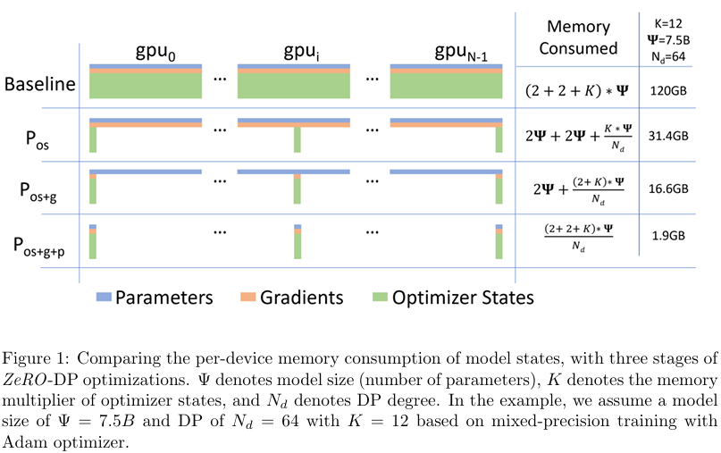

# ZeRO: Memory Optimizations Toward Training Trillion Parameter Models

**Paper:** [ZeRO: Memory Optimizations Toward Training Trillion Parameter Models (Samyam Rajbhandari et al., 2020)](https://arxiv.org/abs/1910.02054)

## Background & Motivation
모델의 크기가 커질수록 더 높은 성능을 보인다는 경험적 관찰에 따라, 딥러닝 모델은 지속적으로 대형화되는 추세를 보이고 있다.
연산 가속기(GPU, TPU 등)의 발전과 대규모 분산 학습 기술의 도입으로 BERT-large (0.3B), GPT-2 (1.5B), Megatron-LM (8.3B), T5 (11B)와 같은 수십억 파라미터 규모의 모델 학습이 가능해졌다.

그러나 이러한 추세에도 불구하고, 단일 가속기의 가용 메모리 증가 속도는 모델 파라미터 수의 증가 속도를 따라가지 못하고 있으며, 단순히 연산 자원을 추가(horizontal scaling)하는 것만으로는 더 큰 모델을 효율적으로 학습하기 어렵다.
특히 기존의 데이터 병렬(data parallelism)은 mini-batch를 분산 처리함으로써 연산 효율은 높지만 모델 전체를 모든 디바이스에 중복 저장해야 하므로 모델 크기 확장성 측면에서 한계가 뚜렷하다.
모델 병렬(model parallelism)은 모델 크기 확장성 측면에서 유리한 반면 모델 크기가 커질수록 연산 및 통신 오버헤드가 급격히 증가하는 한계점을 가진다. 예를 들어 Megatron-LM 기반의 40B 파라미터 모델을 두 개의 DGX-2 노드에 걸쳐 model parallel 방식으로 학습할 경우, inter-node 통신 오버헤드로 인해 GPU당 처리 성능이 하드웨어 peak 대비 5% 미만으로 감소하는 현상을 관찰되었다.

따라서 모델의 크기가 수백억에서 조 단위 개의 파라미터를 가져 여러 노드에 걸쳐서 분산되어야 하는 환경에서도 효과적인 학습을 가능하게 하는 시스템적 해결책이 요구된다.

# Additional Background
이해를 돕기 위해 다음과 같은 모델 학습 상황을 가정한다.

- 1.5B parameter GPT-2 (FP16 parameter copy)
- Mixed precision training (FP32 parameter copy + FP16 gradient)
- Adam optimizer (FP32 momentum + FP32 variance of gradients)

먼저 GPT-2 model parameter를 FP16로 표현 시 이를 저장을 위해 필요한 메모리 크기는 3GB(2Bytes * 1.5B)이다.
다음으로 mixed precision training 방식은 FP32 parameter copy와 FP16 gradient 저장을 위해 각각 6GB와 3GB를 필요로 한다.
마지막으로 각 parameter에 대해 FP32 momentum과 FP32 gradient에 대한 분산 값을 위해 약 12GB의 메모리가 필요하다.
이를 모두 합산하면 3GB 크기의 모델 학습을 위해 적어도 24GB가 필요함을 알 수 있다. 
실제로는 모델 학습을 위해 activation, temporary buffer (중간값 저장 등)를 위해 추가적인 메모리가 필요할 뿐만 아니라 fragmented memory로 인해 사용하지 못하는 메모리 공간도 고려해야 한다.

모델 파라미터 수를 $\Psi$로 두면 모델 학습을 위해 필요한 최소 메모리 크기는 $(2+2+K)\Psi$로 표기할 수 있다 (mixed precision과 Adam 사용시 K=12). 

지금까지 언급했던 메모리 종류를 정리하자면 다음처럼 model states와 residual states로 구분할 수 있다.

1. Model states = optimizer states + gradients + parameters
2. Residual states = activations + temporary buffers + fragmented memory

## Proposed Idea

본 논문에서는 data parallelism (DP)의 장점인 computational and communication efficiency와 model parallelism (MP)의 장점인 memory efficiency를 동시에 살리는 ZeRO-DP를 제안한다.
DP 방식은 model states를 중복해서 모든 디바이스 메모리에 항상 상주시킨다는 문제점이 존재한다. 
여기서 중요한 관찰은 model states는 특정 시점에만 잠깐 사용되고 대부분의 시간에는 불필요하게 메모리 공간을 차지하고 있다는 점이다.
따라서 ZeRO-DP는 model states를 분할해 각 디바이스 메모리에 중복되지 않게 분산시키고 dynamic communication schedule을 통해 필요한 시점에 분산된 model states를 한데 모아 학습을 수행함으로써 대규모 모델을 효과적으로 학습할 수 있는 기회를 제공한다.
본 논문은 추가적으로 activation, temporary buffer, memory fragment를 효과적으로 관리할 수 있는 ZeRO-R 또한 제안한다.

##### Optimizing Model State Memory

ZeRO-DP는 총 3개의 optimization stages를 갖는다. 각 stage 최적화가 진행될수록 학습 시 각 디바이스가 부담해야할 메모리 크기가 크게 감소한다.

$$
\text{Total memory}=2\Psi+2\Psi+12\Psi
$$

- $2\Psi \to \text{FP16 parameters}$
- $2\Psi \to \text{FP16 gradients}$
- $12\Psi \to \text{optimizer states (Adam + mixed precision)}$

1. Optimizer state partitioning ($P_{os}$): optimizer states를 분할해 전체 시스템에 걸쳐 분산한다. 해당 stage 최적화가 완료되면 각 디바이스는 naive DP 방식 대비 약 4배 메모리를 아낄수 있게 된다. $\text{Total memory}=2\Psi+2\Psi+\frac{12\Psi}{N_{d}}$ 에서 $N_{d}$ 가 충분히 크다면 실질적으로 $4\Psi$ 만큼만 메모리 필요. 통신 비용은 이전과 동일.
2. Add gradient partitioning ($P_{os+g}$): gradients를 분할해 전체 시스템에 걸쳐 분산한다. 해당 stage 최적화가 완료되면 각 디바이스는 naive DP 방식 대비 약 8배 메모리를 아낄 수 있게 된다. $\text{Total memory}=2\Psi+\frac{(2+12)\Psi}{N_{d}}$ 에서 $N_{d}$가 충분히 크다면 실질적으로 $2\Psi$만큼만 메모리 필요. 통신 비용은 이전과 동일.
3. Add parameter partitioning ($P_{os+g+p}$): parameters를 분할해 전체 시스템에 걸쳐 분산한다. 해당 stage 최적화가 완료되면 각 디바이스는 naive DP 방식 대비 약 $N_{d}$배 메모리를 아낄수 있게 된다. $\text{Total memory}=\frac{(2+2+12)\Psi}{N_{d}}$. 통신비용 50% 증가.

##### Optimizing Residual State Memory
바로 앞서 설명한 ZeRO-DP는 model states에 대해 최적화를 진행하였다. 
이번에는 activation, temporary buffer, memory fragmentation에 대해 효과적인 메모리 관리가 가능하게 하는 ZeRO-R을 소개한다.

1. Partitioned activation checkpointing: activation이 중복 저장되는 문제를 partitioning을 통해 전체 시스템에 분산시킨다. 필요하면 CPU offloading을 통해 메모리를 추가 확보 가능하다.
2. Constant-size buffers (CB): ZeRO-R은 모델 크기가 증가함에 따라 temporary buffer의 크기가 함께 증가하는 문제를 방지하기 위해, constant-size buffer를 사용한다. 동시에, 해당 버퍼는 연산 효율을 저해하지 않도록 충분한 크기로 설정된다.
3. Memory defragmentation (MD): ZeRO-R은 학습 중 각 텐서의 생명주기를 고려한 능동적 메모리 관리를 통해 효과적으로 memory fragmentation 현상을 최소화한다. 

*Activation checkpointing: backward pass시 필요한 activation값을 모두 메모리에 저장하는 것이 아니라 재계산으로 대체해 메모리 공간을 확보할 수 있음
*CPU offloading: 데이터를 CPU 메모리로 보내 GPU 메모리 확보

##### Data Parallel Communication Volume (Baseline DP)
일반적인 data parallel 분산 학습 기법은 backward pass가 끝난 후 각 디바이스가 구한 gradient를 all-reduce 연산을 통해 다른 디바이스들로 전파해야한다. 
SOTA all-reduce 연산은 두 단계로 진행된다. 먼저 reduce-scatter 연산($\Psi$)을 통해 각 디바이스가 자신이 담당하는 부분에 대한 reduced gradient를 계산해 갖도록 한다. 그 다음으로 all-gather 연산($\Psi$)을 통해 모든 디바이스가 reduced gradient를 갖도록 한다. 
이러한 과정은 전체적으로 $2\Psi$만큼의 전송량을 필요로 한다.

##### Communication Analysis of ZeRO-DP
$P_{os+g}$ stage에서 각 디바이스는 자신이 담당하는 부분(shard)의 reduced gradient를 구하기 위해 reduce-scatter 연산이 필요하다. 
그 후 각 디바이스는 자신이 담당하는 부분의 parameter만 업데이트를 한다.
다음으로 각 디바이스는 자신이 담당하는 updated parameter를 다른 디바이스에 all-gather를 통해 전달한다. 
이러한 과정은 전체적으로 $2\Psi$만큼의 전송량을 필요로 하며 이는 Baseline DP와 동일한 전송량이다.

$P_{os+g+p}$ stage에서는 전체 시스템에 걸쳐 분산되어 있는 부분 parameter를 각각 forward pass와 backward pass 중 필요할때에 맞춰 두 번 all-gather를 해야한다 ($2\Psi$). Backward pass가 끝나면 각 디바이스는 자신이 담당하는 gradient 부분을 다른 디바이스와 공유하기 위해 한 번의 reduce-scatter를 해야한다 ($1\Psi$). 결과적으로 $P_{os+g+p}$ optimization stage에서 드는 총 통신 비용은 $3\Psi$이다.

##### Communication Analysis of ZeRO-R
ZeRO-DP는 model parallelism과 결합된 분산 학습을 지원하지만,
naive한 activation checkpointing은 model parallel 환경에서
activation의 중복 저장으로 인해 과도한 통신 및 메모리 병목을 유발할 수 있다.
ZeRO-R은 partitioned activation checkpointing을 통해
activation을 디바이스 간에 분산 저장함으로써,
상대적으로 작은 추가 model parallel 통신 오버헤드를 감수하는 대신
대규모 data parallel 확장이 가능하도록 한다.
또한 필요에 따라 activation을 CPU 메모리로 offloading함으로써,
일부 I/O 오버헤드를 희생하고 추가적인 GPU 메모리 확보가 가능하다.

## Result
ZeRO 논문의 실험 결과는 ZeRO-DP와 ZeRO-R이 기존 data parallel 및 model parallel 방식 대비 압도적인 메모리 효율을 제공하면서도 학습 성능 저하를 거의 유발하지 않음을 보여준다. ZeRO Stage 1–3를 순차적으로 적용할수록 GPU당 model state 메모리 사용량은 이론적 분석과 일치하게 크게 감소하였으며, 특히 Stage 3에서는 데이터 병렬 degree에 반비례하여 메모리 사용량이 감소해 단일 GPU 메모리 한계를 넘어서는 수백억~조 단위 파라미터 모델 학습이 가능함을 입증했다. 통신량은 Stage 1, 2에서는 baseline DP와 동일하게 유지되었고, Stage 3에서도 약 1.5배 증가에 그쳐 실제 학습 throughput 저하는 제한적이었다. 또한 ZeRO-R을 통해 activation, temporary buffer, fragmentation으로 인한 메모리 낭비가 효과적으로 제거되어, 동일한 하드웨어 환경에서 더 큰 모델과 더 큰 batch size를 안정적으로 학습할 수 있음을 실험적으로 확인하였다.