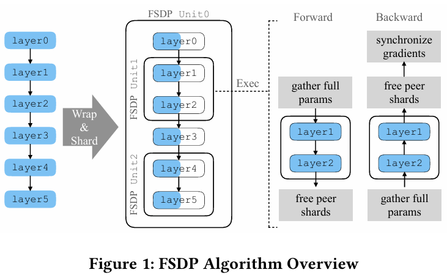
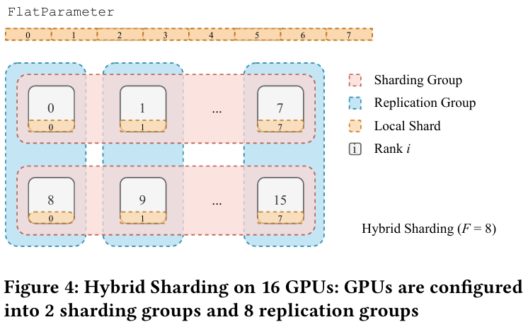

# PyTorch FSDP: Experiences on Scaling Fully Sharded Data Parallel

**Paper:** [PyTorch FSDP: Experiences on Scaling Fully Sharded Data Parallel (Yanli Zhao et al., 2023)](https://arxiv.org/abs/2304.11277)

## Background & Motivation
대규모 언어 모델 및 추천 시스템 모델의 성능은 모델 파라미터 수 증가와 강한 상관관계를 보이며, 최근 수십억~수천억 파라미터 모델이 산업 환경에서도 보편적으로 사용되고 있다.

그러나 단일 GPU의 메모리 용량 증가는 모델 크기 증가 속도를 따라가지 못하고 있으며, 기존의 data parallelism (DP) 방식은 모든 디바이스에 모델 전체를 중복 저장해야 하므로 모델 크기 확장성 측면에서 명확한 한계를 보인다.

한편 model parallelism (MP) 방식은 모델 크기 확장성 측면에서는 유리하지만, 모델 구조에 강하게 종속되며 inter-device / inter-node 통신 오버헤드가 커서 실제 대규모 클러스터 환경에서는 GPU utilization이 급격히 저하되는 문제가 있다.

DeepSpeed의 ZeRO는 model states를 partitioning하여 이 문제를 해결하였으나 특정 모델 아키텍처에 강하게 결합되어 있어 generic solution으로써 활용되기 어렵다는 점과 빠르게 진화하는 ML 프레임워크의 인터페이스에 의존해 구현되기에 변화에 취약하다는 단점이 있다.

따라서 PyTorch 네이티브 환경에서 DDP와 유사한 사용자 경험을 유지하면서 대규모 모델을 안정적으로 학습할 수 있는 산업용 솔루션이 요구되었다.

## Proposed Idea
본 논문에서는 PyTorch Fully Sharded Data Parallel (FSDP)를 제안한다. FSDP는 ZeRO의 세번째 optimization stage (paramter, gradient, optimizer states 모두 partition함)의 개념을 기반으로하되 PyTorch의 Autograd, Tensor implementation, dispatcher system, CUDA caching allocator와 co-design하여 산업 환경에서 안정적으로 사용 가능하도록 재구성한 시스템이다.

FSDP의 핵심 아이디어: 모델을 여러 FSDP unit 단위로 분해하고 각 unit에 대해 model states를 fully sharded 상태로 유지하고 forward/backward 중에 특점시점에 필요한 파라미터를 복원, 사용, 즉시 해제한다.
이러한 방식을 통해 각 디바이스의 peak memory footprint를 효과적으로 제한할 수 있다.

##### Optimizing Model State Memory
FSDP는 각 FSDP unit 단위로 다음 원칙을 따른다.

- Parameters, gradients, optimizer states는 항상 sharded 상태로 유지
- Forward / backward 직전에 해당 unit의 parameter shard를 all-gather
- 계산 후 즉시 peer shard를 해제
- Gradient는 reduce-scatter로 다시 sharding

학습 전체 과정 중, 어떤 한 순간에 파라미터 때문에 GPU가 최대로 필요로 하는 메모리는 다음처럼 수식화 할 수 있다.

$$
    \text{Peak parameter memory} = O(\sum^{N}_{i=1}\frac{\psi_{i}}{F}+max^{N}_{i=1}\psi_{i})
$$

- $\Psi$: 전체 모델 파라미터 수
- $\Psi=\sum^{N}_{i=1}\psi_{i}$
- $F$: shard 개수

위 수식에서 첫번째 term은 각 디바이스가 항상 보유하는 sharded parameter의 크기를 나타내고 두번째 term은 forward 또는 backward pass 중 실제 연산을 위해 일시적으로 materialize되는 가장 큰 FSDP unit의 unsharded flat parameter의 크기를 나타낸다.

이는 ZeRO State-3의 이론적 메모리 절감 효과를 유지하면서도, PyTorch execution model에 자연스럽게 통합되도록 설계된 방식이다.

##### FlatParameter
FSDP는 개별 parameter 단위가 아닌 여러 parameter를 하나로 합친 FlatParameter를 통신 단위로 사용한다.

이런 설계의 이유는 다음과 같다.
- NCCL collective 통신은 1) 입력 크기가 균등하고 2) 충분히 큰 경우 가장 높은 효율을 보인다.
- Parameter 단위 통신은 다수의 불규칙한 크기를 갖는 작은 메세지로 이루어지는 경우가 많고 이는 통신 효율의 급감을 유발한다.

따라서 FlatParameter를 통해 여러 parameter를 flatten + concat하고 적절한 padding을 통해 shard의 크기를 균등화한다. 또한 all-gather / reduce-scatter가 추가 메모리 복사 없이 바로 사용 가능한 레이아웃을 제공한다.
결과적으로 FlatParameter는 효과적인 NCCL 통신을 위해 필수적인 역할을 한다.

##### Sharding Strategies
FSDP는 sharding factor $F$를 도입해 다양한 환경을 지원한다.

1. Full sharding (F=W)
- 모든 디바이스에 1/F shard만 존재
- 최소 메모리
- 최대 통신
2. Hybrid sharding ($1<F<W$)
- shard는 빠른 통신이 가능한 구간(서버 내부)에 한정
- shard group 간에는 replication
- 서버 간 느린 통신을 회피

##### Autograd
FSDP는 PyTorch Autograd 엔진을 수정하지 않는다.

- 기존 parameter는 flat parameter의 view로 맵핑
- Autograd는 기존 parameter를 다루는 것과 동일하게 gardient를 계산
- Gradient는 FlatParameter.gard의 offset에 자동 누적

Gradient reduction은 AccumulatedGrad hook을 통해 gradient가 완전히 준비되는 즉시 reduce-scatter가 실행된다.

이러한 설계 덕분에 FSDP는 foward시 모든 파라미터가 사용되지 않는 케이스와 backward전에 multiple forward가 있는 케이스를 잘 처리한다.

##### Communication Optimization
FSDP는 통신량 감소보다는 통신 latency를 최대한 연산과의 overlap을 통해 critical path에서 제거하는 데 집중한다. 쉽게 표현하자면 GPU가 연산하고 있을때 다음 연산에 필요한 데이터를 준비해 현재 연산이 끝나면 바로 다음 연산을 시작해 전체의 throughput을 증가시키는 것이다.

다음은 통신 최적화를 위해 사용된 주요 기법들이다

1. Computation stream과 communication stream의 분리: GPU 연산과 통신의 overlap을 자유롭게함
2. Backward prefetching: forward 실행 순서를 기록해 backward에서 다음 unit parameter를 미리 all-gather
3. Forward prefetching: static computational graph가 있는 경우 CPU bottleneck을 완화
4. Rate limiter: CUDA caching allocator fragmentation을 방지하고 infight all-gather 수를 제한

##### Deferred Initialiation
대규모 모델은 학습 단계뿐만 아니라 모델 초기화 단계에서부터 단일 GPU 메모리를 초과하는 경우가 빈번하다. 기존 PyTorch 모델 초기화 방식은 모든 parameter tensor를 실제 디바이스에 할당한 후 초기화를 수행하기 때문에, 모델이 디바이스 메모리에 적재되지 못하면 학습이 시작하기도 전에 실패한다.

따라서 FSDP에서는 이를 해결하기 위해 dummy device 기반의 deferred initialization 기법을 도입해 모델 초기화 시 실제 GPU 메모리를 할당하지 않고 dummy device 상에서 초기화 연산을 기록한 후, FSDP unit 단위로 해당 연산을 GPU에서 replay하며 즉시 sharding을  수행한다. 이를 통해 초기화 단계부터 GPU 메모리 한계를 회피하면서도, 사용자는 로컬 학습과 동일한 방식으로 모델을 정의하고 사용할 수 있다.

## Result
실험 결과는 다음을 입증한다.

- 소형 모델에서는 DDP와 유사한 성능
- 수백억~수천억 파라미터 모델 학습 가능
- 최대 512 GPU까지 near-linear TFLOPS scaling 가능
- 실제 산업 환경에서 안정적으로 사용 가능