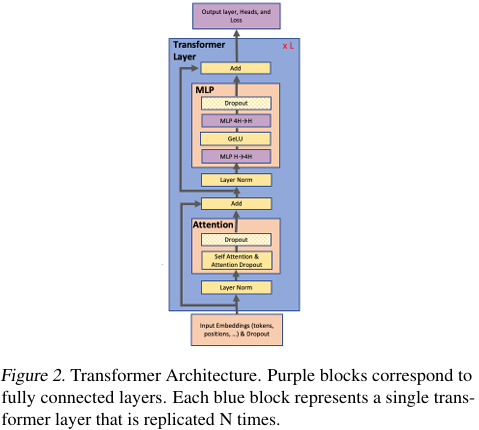
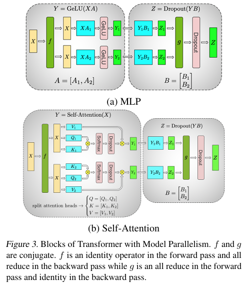
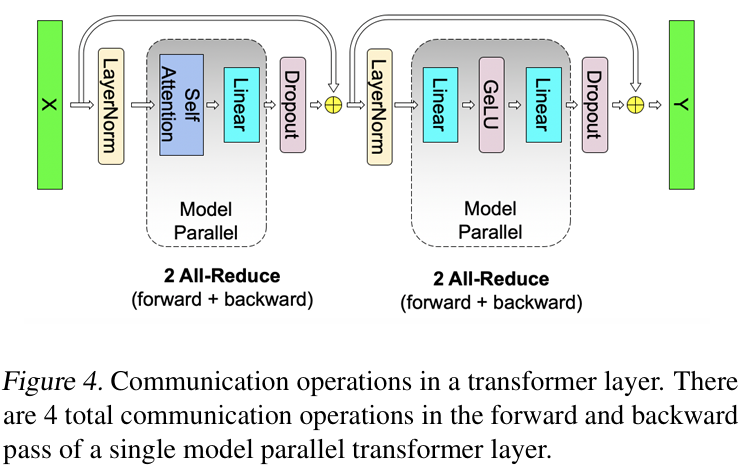

# Megatron-LM: Training Multi-Billion Parameter Language Models Using Model Parallelism

**Paper:** [Megatron-LM: Training Multi-Billion Parameter Language Models Using Model Parallelism (Mohammad Shoeybi et al., 2020)](https://arxiv.org/abs/1909.08053)

## Background & Motivation
최근 Natural Language Processing(NLP) 분야는 가속기의 발전과 대규모 학습 데이터의 가용성 증가에 힘입어 급격한 발전을 이루어왔다. 
경험적 연구를 통해 언어 모델의 파라미터 수가 증가할수록 article completion, question answering, natural language inference와 같은 다양한 NLP 태스크에서 성능이 일관되게 향상된다는 사실이 확인되었으며, 이는 점점 더 큰 언어 모델을 학습하려는 연구 트렌드으로 이어지고 있다.

그러나 모델의 크기가 커질수록 단일 GPU 또는 단일 노드는 빠르게 메모리 한계에 봉착하게 된다. 특히 ADAM과 같은 널리 사용되는 최적화 알고리즘은 각 weight에 대해 모멘트 추정을 위한 추가적인 optimizer state를 요구하므로, 실제로 모델 파라미터 자체보다 훨씬 큰 메모리 사용량을 유발한다. 이로 인해 단순한 data parallelism (DP)만으로는 수십억 파라미터 규모의 모델을 학습하는 데 근본적인 한계가 존재한다 (DP에서는 모델 전체가 하나의 디바이스에 로드되야함).

이러한 문제를 해결하기 위해 기존 연구들은 model parallelism (MP) 기반의 접근을 제안해왔다. 대표적으로 GPipe(Huang et al., 2018)는 레이어 단위의 pipeline model parallelism을 통해 모델을 여러 디바이스에 분산하는 방법을 제시하였고, Mesh-TensorFlow(Shazeer et al., 2018)는 텐서 차원 단위로 분산 연산을 기술할 수 있는 일반적인 프레임워크를 제안하였다. 그러나 pipeline model parallelism은 pipeline bubble, micro-batch 스케줄링, 그리고 복잡한 실행 흐름으로 인해 GPU 활용도가 저하될 수 있으며, Mesh-TensorFlow와 같은 일반적인 tensor parallel 프레임워크는 커스텀 컴파일러나 복잡한 시스템 구성에 대한 의존성을 요구한다는 단점이 있다.

따라서 대규모 언어 모델 학습을 위해서는, 기존 접근 방식들의 한계를 극복하면서도 모델 구조의 변경이나 복잡한 시스템 의존성을 최소화할 수 있는 새로운 model parallel 전략이 요구된다. 본 논문은 Transformer 구조가 본질적으로 intra-layer 수준에서 병렬화에 유리한 특성을 가진다는 점에 주목하고, 이를 활용한 간단하면서도 효율적인 intra-layer model parallelism 기법을 제안한다.

## Proposed Idea
본 논문에서는 간단하고 효율적인 model parallel 접근 방식을 통해 intra-layer model parallelism을 구현한다. 
Transformer는 이러한 model parallelism을 적용하기 유리한 구조로 되어있다.

위 다이어그램을 보면 하나의 Transformer layer는 self-attention block과 뒤따르는 두개의 linear layer로 구성된 MLP block으로 이루어져 있다.

먼저 본 논문에서는 MLP block의 첫번째 레이어의 가중치 A를 column-wise하게 나누어 각각 다른 디바이스에 분배한다. 
반면 입력 X는 나누지 않고 전체를 각각 다른 디바이스에 중복해서 둔다. 
입력 X의 중복을 허용하는 이유는 입력 X를 column-wise하게 가중치 A를 row-wise하게 쪼개서 각각 다른 디바이스로 분배해 첫번째 MLP 연산을 하게되는 경우 non-linearity (e.g. GeLU) 연산전에 all-reduce 동기화 과정을 수반하기 때문이다.
대신 입력 X의 중복을 허용해 추가적인 디바이스간 동기화를 피할수 있다.
결과적으로 forward pass에서는 MLP block에서 두 번째 linear layer 이후에 한 번의 all-reduce ($g$)만 수행하면 된다 (backward pass에서는 $f$에서 동기화).

다음으로 self-attention block에서는 multihead attention 연산에 내재된 병렬화 기회를 바로 활용할 수 있다. 
Forward pass의 경우, 각 head는 다른 디바이스로 분배되어 독립/병렬적으로 연산되고 dropout으로 들어가기 전에 $g$에서 all-reduce 된다 (backward pass의 경우 $f$에서 동기화). 

결과적으로 본 연구에서 제안하는 intra-layer model parallelism 방식은 각 레이어에 대해 forward pass와 backward pass을 통틀어 4번의 동기화만 필요로해 효과적인 model parallel training을 가능하게 한다.

Transformer language model의 output embedding 행렬 E는 hidden size H 와 vocabulary size V를 가지며, H x V 차원의 GEMM 연산이 필요하다.
Vocabulary size가 매우 크기 때문에 output embedding GEMM 역시 여러 디바이스에 분산하여 병렬 처리할 수 있다. 이 경우 각 디바이스에서 계산되는 결과는 vocabulary의 일부에 해당하는 partial logits이다.

단순한 방식으로는 각 디바이스에서 계산된 partial logits을 all-gather하여 전체 logits을 구성한 뒤 cross-entropy loss를 계산할 수 있다. 그러나 이 방식은 all-gather 과정에서 b x s x v에 해당하는 막대한 통신 비용을 유발한다 (b는 batch size, s는 sequence length).

이러한 통신 비용을 줄이기 위해 본 연구에서는 logits를 all-gather하지 않고, 각 디바이스가 보유한 partial logits을 이용해 cross-entropy loss의 구성 요소를 분산 계산한 뒤, scalar 단위의 loss(또는 b x s 차원의 loss 텐서)만 all-reduce로 합산한다. 이를 통해 통신 비용을 b x s 수준으로 크게 줄일 수 있으며, 이는 model parallel 학습의 효율을 크게 향상시킨다.

본 논문의 핵심 철학은 최대한 communication-bound한 상황을 피하고 compute-bound를 지향하자는 것이다. 
쉽게 말해, 일부 중복 계산(duplicate computation)을 감수하더라도 집합 통신 비용을 최소화함으로써 전체 시스템 성능을 향상시키는 것을 목표로 한다. 
예를들어 상대적으로 연산량이 적고 broadcast를 위한 통신 비용이 큰 dropout, layer normalization, 또는 residual 연산들을 하나의 디바이스에서 수행하고 결과를 다른 디바이스와 통신해 공유하는 대신 각 디바이스에서 중복 계산하는 것이 시스템 관점에서 더 효율적이다.

## Result
논문에서 model parallel only 실험은 8-way tensor model parallel을 사용했으며, 단일 GPU 기준 strong scaling 대비 약 77%의 효율을 보였다. 부연설명하자면 하나의 GPU로 1초에 1개의 작업이 처리가능하다고할때 이론적으로는 10개의 GPU를 사용하면 초당 10개의 작업이 처리가 가능하다. 하지만 현실에서는 많은 경우 완전한 병렬화가 불가능하고 이때 50%의 효율이라고하면 10개의 GPU를 사용하더라도 초당 5개의 작업 처리만 가능했다는 의미이다.

Model parallel과 data parallel을 결합한 실험에서는 8-way tensor model parallel로 구성된 모델을 64개의 data parallel replica로 복제하여 총 512개의 GPU에서 학습을 수행하였다. 각 data parallel replica는 서로 다른 mini-batch를 처리하고 각 data parallel group 내에서 gradient를 all-reduce로 동기화한 뒤, 각 GPU가 로컬 파라미터를 직접 업데이트한다.

이 경우 전체 scaling efficiency는 약 74%로, data parallel에 따른 추가적인 gradient 동기화 비용으로 인해 model parallel only 대비 소폭 감소하지만, 단위 시간당 처리량은 여전히 수십 배 이상 증가한다.

Megatron-LM은 vanilla GPT-2와 (안정화를 위해) 약간의 수정된 BERT를 수십억 파라미터까지 확장 가능하게 했고, 그 결과 모델 크기 증가에 따른 성능 향상이 실제로 유지됨을 실험적으로 보였다.