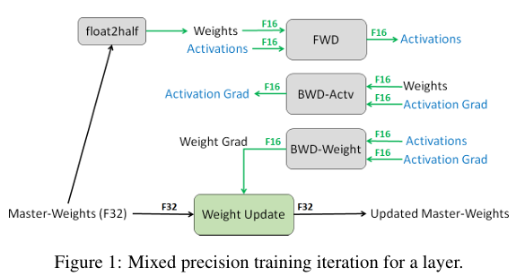
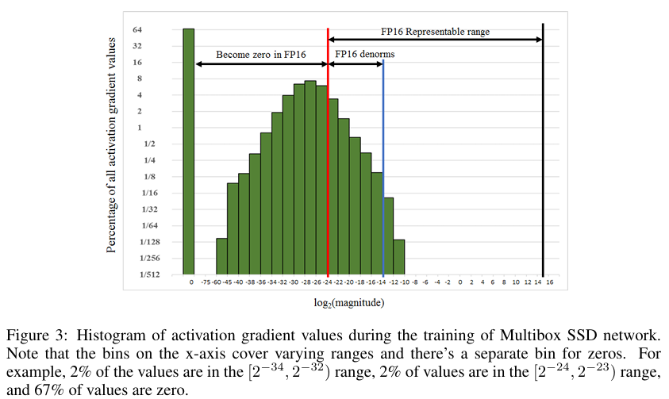

# Mixed Precision Training

**Paper:** [Mixed Precision Training (Sharan Narang et al., 2018)](https://arxiv.org/abs/1710.03740)

## Background & Motivation
Deep learning은 image recognition, language modeling, machine translation, speech recognition 등 다양한 분야에 걸쳐 성능의 발전을 이끌어냈다.

이러한 성능 향상은 더 많은 학습 데이터와 더 크고 복잡한 모델을 사용할수록 더욱 두드러진다.

그러나 대규모 모델과 대량의 데이터는 필연적으로 더 많은 연산 자원과 메모리 자원을 요구한다.
이러한 요구사항은 정밀도를 낮춘(reduced precision) 표현과 산술 연산을 사용함으로써 완화할 수 있다.

일반적으로 neural network 학습/추론 속도는 다음 세 가지 요소에 의해 결정된다.

1. Arithmetic bandwidth
2. Memory bandwidth
3. Latency

Arithmetic bandwidth는 연산기가 단위 시간에 처리할 수 있는 연산량을 의미하며, 어떤 작업이 이를 최대한 활용하고 있다면 compute-intensive(=compute-bound) 작업이라고한다.

Memory bandwidth는 메모리에서 데이터를 읽고 쓰는 최대 속도를 의미한다. 작업이 이 대역폭을 모두 사용하여 병목이 발생한다면 memory-intensive(=memory-bound) 작업이라고 한다.

어떤 작업이 compute-bound도 아니고 memory-bound도 아니라면, 남아 있는 지연은 다른 요인에 의해 발생하며 이를 latency-bound라고 한다.

Reduced-precision 표현은 먼저 필요 메모리 용량 자체를 줄일 수 있다는 점에서 이점을 가진다. 

또한 일부 하드웨어에서는 reduced-precision 연산(FP16 등)이 single-precision(FP32)에 비해 훨씬 높은 처리량을 제공한다. 

예를 들어 최근 GPU는 half-precision (FP16) 연산에서 single-precision (FP32) 대비 2~8배의 연산 속도 향상을 제공한다. (Single-precision은 full-precision이라고도 불림)

이와 같은 장점 덕분에 reduced precision을 활용한 효율적인 학습 기법이 지속적으로 연구되어 왔다. 

하지만 기존 연구들은 여전히 forward/backward 과정에서 FP32를 필요로 하거나, 무시하기 어려운 수준의 accuracy loss, 또는 모델 아키텍처를 변경해야 하는 한계가 있었다. 

따라서 accuracy를 유지하면서도 reduced precision을 안정적으로 활용하는 방법론이 요구된다.  

## Proposed Idea
본 논문에서는 모델 accuracy를 보존하는 동시에 reduced precision으로 모델을 효율적으로 학습하는 문제를 다룬다. 

보다 구체적으로는, IEEE half-precision format(FP16) 을 사용하여 다양한 neural network를 학습하는 방법을 제안한다. 

그러나 FP16은 FP32에 비해 dynamic range가 좁아, 그대로 사용할 경우 gradient underflow(값이 표현가능 최소치 밑일 경우 부정확해지거나 0으로 수렴) 및 update 소실 등으로 인해 model accuracy가 감소하는 문제가 발생할 수 있다.

이를 해결하기 위해 본 연구에서는 다음 세 가지 핵심 기법들을 제안한다. 

1. Maintaining a master copy of weights in FP32 (weight update 시 precision loss 방지)
2. Loss-scaling (gradient가 0으로 사라지는 문제 최소화)
3. FP16 arithmetic with accumulation in FP32 (FP16 연산은 사용하되 누적은 FP32로 수행해 정확도 유지)

이러한 기법들을 조합함으로써, 본 연구는 FP16 기반의 mixed-precision training이 기존의 FP32 학습과 동등한 수준의 모델 성능을 유지함을 다양한 모델과 작업에서 실험적으로 보인다.

##### 1. FP32 Master Copy of Weights
Mixed precision training에서는 FP32 학습과 동등한 수준의 accuracy를 유지하기 위해 FP32 weight master 원본을 보관하고 가중치 업데이트시 활용한다. 

위 Figure 1에서는 매 학습 iteration마다 실제로 일어나는 일을 보여준다. 

매 iteration마다 FP32 master-weights는 FP16으로 변환 후 forward/backward pass에 활용된다.

가중치 업데이트는 FP32 master-weight copy에 FP16 weight gradient를 사용하여 이루어진다. 

FP32 master-weight copy를 유지해야 하는 이유는 보통 다음 두 가지로 설명된다. 

1. **Gradient underflow 문제**: FP16 기반 weight update 과정에서, gradient x learning rate 결과가 FP16의 표현 범위보다 작아 0으로 처리되는 경우가 발생한다. 이 값은 실제로는 학습에 유의미한 update이며, 0으로 사라질 경우 모델 정확도에 부정적인 영향을 미친다.
2. **Weight와 weight update의 크기 차이 문제**: weight 값이 update 값보다 2048배($=2^{11}$) 이상 클 경우, 두 값을 더할 때 update의 소수점 정렬 과정에서 update가 mantissa 비트(10bit)를 초과하여 오른쪽으로 밀리면서 0으로 소실될 수 있다. 이는 update 값이 FP16으로 표현 가능한 값이어도, 덧셈 연산 자체에서 사라져버리는 문제이다.
메모리 측면에서 FP32 master weight와 FP16 weight를 모두 유지하면, FP32 weight만 사용하는 경우에 비해 가중치 저장에 약 50%의 추가 메모리가 필요하다.
그러나 전체 학습 메모리 사용량 대부분은 activation 저장이 차지하므로, FP32 master copy를 추가로 유지하는 비용은 실질적으로 매우 작은 편이다.

##### 2. Loss Scaling
FP16의 exponent 비트 수는 5비트이기 때문에 표현할수 있는 exponent 범위가 매우 제한적이다. 

그 결과 FP16은 "아주 큰 값" 또는 "아주 작은 값", 특히 딥러닝 학습에서 흔하게 등장하는 작은 gradient 값을 정확하게 표현하기가 어렵다.

위는 Multibox SSD detector network를 FP32로 학습할 때 activation gradient값의 히스토그램을 보여준다. 

대부분의 gradient가 매우 작은 값들로 구성되어 있어, FP16이 표현할 수 있는 범위의 하단을 벗어나 0으로 처리될 가능성이 높다는 것을 확인할 수 있다. 

즉, FP16은 실제 gradient 분포의 대부분을 효과적으로 표현하지 못하고 있다.

이 문제를 해결하는 방법이 loss scaling이다. gradient를 일괄적으로 오른쪽(큰 값 방향)으로 shift하기 위해 일정한 상수(scaling factor)를 곱해 FP16 표현 범위 안으로 밀어 넣는 방식이다.

실험적으로 Multibox SSD network의 경우 graident에 8을 곱하는 scaling을 적용했을 때, FP16 기반 학습에서도 FP32와 거의 동일한 정확도를 얻을 수 있었다. 

이는 scaling이 작은 gradient가 0으로 소실되는 문제를 방지했다는 의미이다. 

Scaling factor를 선택하는 방법에는 여러 접근이 존재하며, 이에 대한 자세한 내용은 논문 섹션 3.2에서 다루고 있다.

##### 3. Arithmetic Precision
Neural network에서 사용하는 연산을 크게 다음 세 가지 카테고리로 분류할수 있다.

1. Vector dot-products
2. Reductions
3. Point-wise operations

위 세 가지 카테고리는 각각 다른 방식의 reduced precision 연산 방식으로 다루어야한다.

먼저 vector dot-product는 FP16 입력을 사용하되 accumulation 중에는 FP32로 다루고 최종 결과는 FP16으로 변환해 메모리에 쓰는 것이 모델 정확도 유지에 좋다. 

Volta 아키텍처부터 도입된 Tensor Core는 FP16 입력-FP32 출력 multiply-add 연산 기능 지원.

다음으로 large reduction(한 백터의 모든 요소를 더하는 것)은 batch-norm이나 softmax에서 흔히 등장하며 입력은 FP16으로 다루며 출력은 FP32로 다루어야한다. 

Large reduction 연산은 memory-bound이므로 arithmetic 연산 속도에는 거의 영향을 받지 않아 출력은 FP32로 사용해도 무방하다.

Non-linearities(ReLU, sigmoid 등) 또는 element-wise 연산 (행렬 원소 단위 곱셈 등)과 같은 point-wise operations 역시 대부분 memory-bound이다.

따라서 이러한 연산들은 FP16 또는 FP32 중 어느 precision을 사용하더라도 연산 속도 측면에서 크지 않기에 아무거나 사용해도 무방하다.

## Result
본 실험의 baseline 모델은 activation, weight, gradient 모두 FP32로 학습한 결과를 사용한다.
반면 본 논문에서 제안한 mixed precision (MP) 학습 방식은 activation, weight, gradient를 FP16으로 저장하고 연산하며, weight update를 위해 FP32 master copy를 유지하는 구조를 따른다.

실험 결과, 다양한 네트워크(CNN, RNN, GAN 등)에 대해 MP 학습이 FP32 baseline과 거의 동일한 정확도를 달성함을 확인하였다. 

이는 FP16 사용으로 인한 precision 손실을 FP32 master weight, loss scaling, arithmetic precision 등의 기법을 통해 효과적으로 보완했음을 의미한다.

한편, 학습 속도(speed)는 본 논문에서 직접 비교 결과를 제시하지 않는다. 논문에서도 언급하듯, 실제 속도 향상은 프레임워크와 커널 수준의 mixed-precision 최적화 정도에 강하게 의존하기 때문에, 당시 시점에서는 일관된 속도 수치를 제공하기 어려운 상황인듯 하다. 

다만 FP16은 FP32에 비해 연산량 감소 및 메모리 트래픽 감소 효과가 있으므로, GPU 아키텍처(특히 Tensor Core 기반 Volta)에서는 약 2~8배의 연산 속도 향상이 가능할 것이라고 논문에서는 기대하고 있다.

