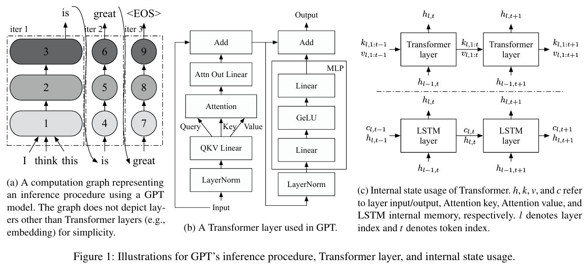
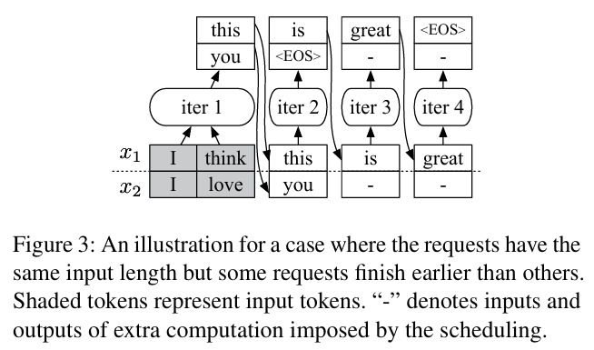
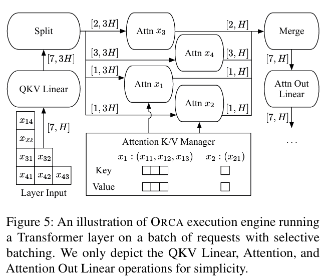

# Orca: A Distributed Serving System for Transformer-Based Generative Models

**Paper:** [Orca: A Distributed Serving System for Transformer-Based Generative Models (Gyeong-In Yu et al., 2022)](https://www.usenix.org/conference/osdi22/presentation/yu)

## Background & Motivation
최근 chatbot, summarization, code generation, caption generation과 같은 다양한 어플리케이션에서 language generation task의 중요성이 점차 커지고 있다. AI21 Labs, DeepMind, Google, Meta, Microsoft, NVIDIA, OpenAI와 같은 빅테크 기업들은 translation, classification, question-answering과 같은 기존 NLP 작업들 또한 language generation problem으로 통합해 다루는 것이 효과적임을 보여주었다. 더 나아가 생성형 모델은 언어 도메인에만 국한되지 않고 image, video, speech 등 다양한 영역에서 확장 가능하다는 점에서 그 잠재력이 매우 크다.

학습된 머신러닝(ML) 모델을 실서비스에 적용하기 위해서는 일반적으로 low latency, high throughput을 동시에 달성하는 효율적인 추론 서빙 시스템이 요구된다. 기존 ML 모델의 경우 입력과 출력의 크기가 고정되어 있는 경우가 대부분이었으며, 이러한 특성을 바탕으로 고정된 입출력 모델에 대한 효과적인 추론 서빙 시스템에 관한 많은 연구 성과가 축적되어 왔다. 특히 request-level batching은 GPU 활용도를 높이기 위한 가장 일반적인 기법으로, 최대 batch size 조절만으로도 latency-throughput 간의 trade-off를 비교적 쉽게 제어할 수 있었다.

그러나 Transformer 기반 생성형 모델 추론은 이러한 기존 ML 모델과 근본적으로 다른 특성을 가진다. 생성형 모델은 autoregressive decoding 방식으로 동작하며, 하나의 request를 처리하기 위해 여러 iteration을 수행하고 각 request마다 입력 길이와 생성되는 출력 토큰 수가 서로 다르다. 즉, 각 request는 서로 다른 수의 iteration을 필요로 한다.

기본 request-level scheduling 방식에서는 이러한 차이를 고려하지 못하고, 하나의 batch에 포함된 모든 request를 동일한 iteration 흐름으로 묶어 처리한다. 그 결과, decoding 과정에서 먼저 종료된 request는 다른 request가 종료될 때까지 대기해야 하며, 이미 종료된 request에 대해서도 불필요한 연산과 메모리 자원이 소모된다. 또한 새로운 request가 중간에 도착하더라도 현재 batch의 처리가 완료될 때까지 기다려야 하므로, 높은 latency, 낮은 throughput, 그리고 컴퓨팅 리소스의 비효율적인 사용이라는 문제가 발생한다. 이러한 이유로 request-level scheduling은 LLM 추론 workload에 구조적으로 부적합하다.

## Proposed Idea
이러한 문제를 해결하기 위해 ORCA는 Transformer 기반 생성형 모델을 위한 iteration-level scheduling을 제안한다. ORCA는 request 단위가 아닌, 매 token generaton iteration마다 실행을 스케줄링함으로써 완료된 request는 즉시 반환하고 새롭게 도착한 request는 다음 iteration부터 처리할 수 있도록 한다. 이를 통해 early-finished request로 인한 불필요한 대기와 late-arriving request의 긴 queueing delay를 제거한다.

다만 iteration-level scheduling을 실제 시스템에 적용하기 위해서는 batching과의 양립이라는 중요한 기술적 과제가 존재한다. Transformer 연산 중 QKV Linear, Attn Out Linear, MLP 등 대부분의 연산은 고정된 linear weight에 대해 토큰별로 독립적으로 수행되는 연산이므로, request의 진행 단계와 무관하게 token-wise batching이 가능하다. 반면 Attention 연산은 현재 token이 이전 token들의 Key/Value에 접근하는 token 간 상호작용 연산으로, 각 request마다 누적된 KV cache의 길이가 달라 입력 tensor shape이 서로 다르기 때문에 batching이 불가능하다.

ORCA는 이러한 특성을 이용해 selective batching 기법을 도입한다. Attention 연산만 request 단위로 분리하여 개별적으로 수행하고, 나머지 연산에는 token-wise batching을 적용함으로써 GPU 활용도를 유지한다. 즉, batching이 불가능한 연산만 분리(split)하여 처리한 뒤 다시 병합(merge)함으로써, iteration-level scheduling과 batching을 동시에 가능하게 하는 시스템 설계를 제시한다. 

## Result
실험 결과, ORCA는 기존 NVIDIA FasterTransformer 기반 서빙 시스템 대비 현저한 성능 향상을 보였다. 특히 요청마다 생성 길이가 다른 현실적인 워크로드 환경에서 ORCA는 latency를 크게 줄이면서도 높은 throughput을 유지하였다. GPT-3 175B 모델 기준으로 동일한 latency 수준에서 최대 36.9배 높은 throughput을 달성하였으며, 이는 iteration-level scheduling을 통해 early-finished request를 즉시 반환하고 late-arriving request를 효율적으로 처리함으로써 컴퓨팅 자원 활용도를 극대화한 결과이다.
