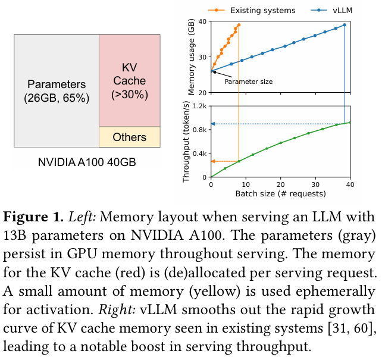
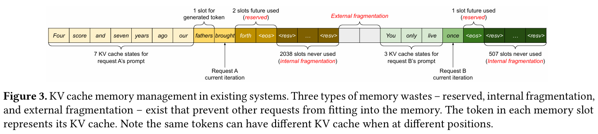
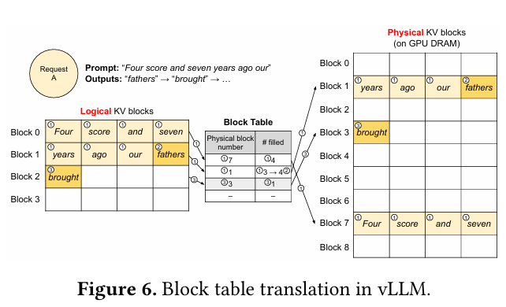
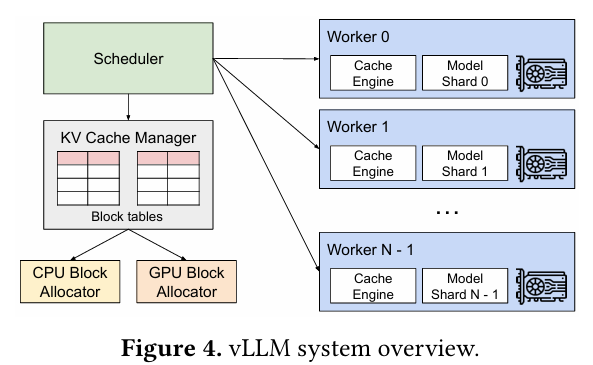
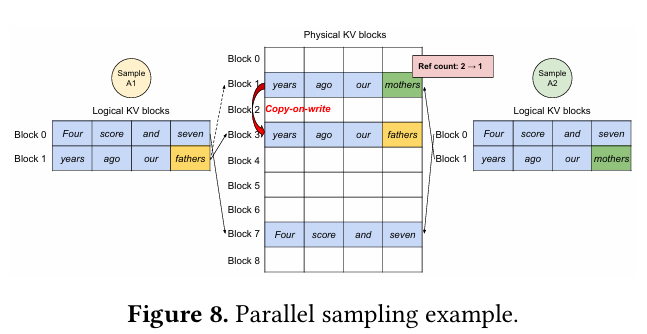
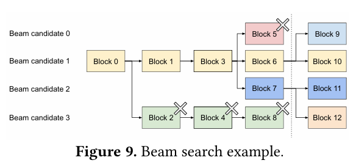
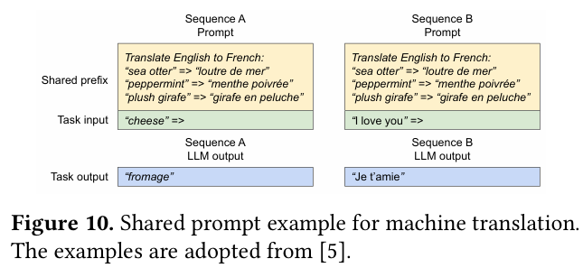

# Efficient Memory Management for Large Language Model Serving with PagedAttention

**Paper:** [Efficient Memory Management for Large Language Model Serving with PagedAttention (Woosuk Kwon et al., 2023)](https://arxiv.org/abs/2309.06180)

## Background & Motivation
대규모 언어 모델(LLM)은 프로그래밍 어시스턴스, 범용 챗봇 등 다양한 서비스로 빠르게 확산되고 있다. 그러나 LLM 서빙은 매우 높은 비용을 수반하며, 단일 요청 처리 비용이 기존 키워드 검색 대비 최대 10배 이상 비싸다는 단점이 존재한다. 이를 완화하기 위한 직관적인 접근은 여러 요청을 동시에 처리하는 batching이지만, GPU 환경에서 LLM 서빙은 본질적으로 메모리 병목(memory-bound) 문제에 의해 확장성이 제한된다.

Transformer 기반 LLM 서빙은 크게 prompt phase (encoding)와 autoregressive generation phase (decoding)로 구성된다. 특히 decoding 단계에서는 이전 토큰들의 Key-Value(KV) 캐시를 지속적으로 참조해야 하며, 이 KV 캐시는 토큰 수에 비례해 선형적으로 증가한다. 예를 들어 OPT-13B 모델의 경우, 2048 토큰에 대한 KV 캐시만으로 약 1.6GB의 메모리가 필요하다.

문제는 GPU의 연산 성능 증가 속도에 비해 메모리 용량 증가는 매우 제한적이라는 점이다. A100 대비 H100 GPU는 연산 성능은 약 5배 증가했지만, 메모리 용량은 거의 동일하다. 기존 LLM 서빙 시스템들은 출력 길이를 사전에 알 수 없기 때문에, 요청마다 최대 길이를 가정해 연속적인 메모리를 정적으로 할당하는 방식을 사용해 왔고, 이로 인해 심각한 내부/외부 단편화(fragmentation)와 메모리 낭비가 발생한다. 이러한 배경에서, LLM 서빙을 위한 보다 정교한 메모리 관리 기법이 필수적인 문제로 대두된다.

## Proposed Idea
본 논문은 운영체제의 페이징(paging) 개념을 LLM KV 캐시 관리에 적용한 PagedAttention을 제안한다. 핵심 아이디어는 KV 캐시를 가변 길이의 연속 메모리로 관리하는 대신, 고정 크기의 KV block(KV page)단위로 분할하여 관리하는 것이다. 이를 통해 외부 단편화를 완전히 제거하고, 각 요청당 최대 한 개 block에서만 내부 단편화가 발생하도록 제한한다.

이 아이디어를 구현한 시스템이 바로 vLLM이다. vLLM은 중앙 집중식 스케줄러, KV cache manager, GPU/CPU block allocator로 구성되며, decoding 단계에서 필요한 KV block들을 동적으로 할당, 해제한다. 또한 copy-on-write(CoW)와 reference counting 기법을 활용해, parallel sampling(한 요청에 대해 여러개의 답변 생성), beam search(출력 후보군을 효과적으로 탐색), shared prefix(공통된 시스템 프롬프트)와 같은 고급 디코딩 시나리오에서 KV 캐시를 효율적으로 공유한다.

예를 들어 parallel sampling에서는 여러 출력이 동일한 prefix를 공유하다가 divergence 시점 이후에만 KV block을 새로운 분기점을 위해 할당하며, beam search에서는 beam 간 공통 prefix에 대해 block을 공유하고 불필요해진 block은 즉시 반환한다. 또한 시스템 프롬프트와 같은 shared prefix는 여러 사용자 요청 간에도 공유될 수 있다.

vLLM은 이러한 PagedAttention 구조를 기반으로 Megatron-LM 스타일의 tensor model parallelism을 지원하여, 단일 GPU 메모리를 초과하는 대규모 모델에서도 효율적인 분산 실행이 가능하도록 설계되었다.

## Result
논문에서는 OPT(13B, 66B, 175B) 및 LLaMA-13B 모델을 대상으로, NVIDIA A100 GPU 환경에서 실험을 수행하였다. 워크로드는 ShareGPT, Alpaca, WMT16 등 실제 LLM 서비스 특성을 반영한 데이터셋을 기반으로 생성되었으며 요청 도착은 Poisson 분포로 모델링되었다.

vLLM은 FasterTransformer 및 Orca 계열 시스템과 비교되었으며, 주요 평가지표는 normalized latency(출력 토큰 수로 정규화된 end-to-end latency)이다. 실험 결과, vLLM은 기본 sampling 시나리오에서 최대 22x, 일반적인 설정에서도 2~4x 수준의 처리량 향상을 달성하였다. Parallel sampling, beam search, shared prefix와 같은 고급 디코딩 시나리오에서도 기존 시스템 대비 일관되게 높은 처리량을 유지하였다.

이 결과는 PagedAttention 기반 메모리 관리가 KV 캐시 단편화 문제를 효과적으로 해결할 뿐 아니라, 실제 LLM 서빙 환경에서 throughput과 메모리 효율을 동시에 개선할 수 있음을 보여준다.